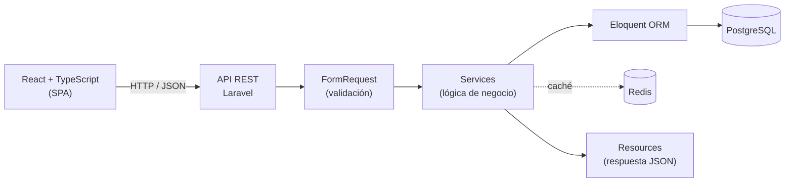

# SCIEM — Sistema de Control de Ingreso a Exámenes Masivos

Plataforma web para el control de ingreso, la validación de estudiantes y la gestión de incidentes en exámenes universitarios.

Proyecto desarrollado por **Corvus Code S.R.L.** para la Convocatoria Pública **CPTIS-452026-2026**, en el marco de la materia **Taller de Ingeniería de Software (TIS)** de la Universidad Mayor de San Simón (UMSS).

---

## Contenido

- [Funcionalidades principales](#funcionalidades-principales)
- [Arquitectura](#arquitectura)
- [Stack tecnológico](#stack-tecnológico)
- [Estructura del repositorio](#estructura-del-repositorio)
- [Requisitos previos](#requisitos-previos)
- [Instalación y ejecución](#instalación-y-ejecución)
- [Pruebas](#pruebas)
- [Convenciones](#convenciones)
- [Flujo de trabajo](#flujo-de-trabajo)
- [Documentación](#documentación)
- [Empresa](#empresa)

---

## Funcionalidades principales

- **Seguridad:** cuentas de usuario, roles (Administrador, Docente, Auxiliar), permisos y bitácora de operaciones.
- **Gestión académica:** materias, grupos y carga de nóminas de estudiantes (CSV, XLSX y PDF).
- **Exámenes:** creación de exámenes, asignación de grupos y ambientes, invitación a docentes colaboradores y habilitación de auxiliares.
- **Control de ingreso:** punto de control, identificación y validación de estudiantes, registro de tardanzas e intentos no autorizados, en tiempo real.
- **Incidencias:** registro y revisión de faltas durante el examen, con evidencia y trazabilidad.
- **Centrales de riesgo:** historial de antecedentes disciplinarios, con una central académica y otra de admisión independientes entre sí.
- **Admisión** *(fase posterior)*: modalidades, convocatorias y exámenes de admisión.

---

## Arquitectura

SCIEM utiliza un **monolito modular desacoplado** con **MVC + capa de Services**:

- **Frontend:** SPA en React + TypeScript, organizada por *features*.
- **Backend:** API REST en Laravel. Los controladores delegan la lógica de negocio a Services organizados por módulo.
- **Despliegue:** una sola aplicación. Apache sirve el frontend compilado y la API desde el mismo origen.



### Módulos

| Módulo backend | Feature(s) frontend | Responsabilidad |
|---|---|---|
| `Security` | `auth`, `users`, `audit-log` | Autenticación, cuentas, roles, permisos y bitácora |
| `Academic` | `subjects`, `groups`, `students` | Materias, grupos y nóminas |
| `Exams` | `exams`, `classrooms`, `assistants` | Exámenes, ambientes, auxiliares y reportes |
| `EntryControl` | `entry-control` | Punto de control y validación de ingreso |
| `Incidents` | `incidents` | Registro y revisión de incidencias |
| `RiskCenter/Academic` | `risk-center/academic` | Central de Riesgo Académica |
| `RiskCenter/Admission` | `risk-center/admission` | Central de Riesgo de Admisión |
| `Admissions` | `admissions` | Procesos de admisión |

### Actualización en tiempo real

Las pantallas de control de ingreso, seguimiento del examen e incidencias se actualizan mediante **consulta periódica** (hook `usePolling`), un mecanismo compatible con la infraestructura de despliegue disponible.

> La justificación completa de la arquitectura se documentará en `docs/architecture/justificacion-arquitectura.md` (pendiente de redactar).

---

## Stack tecnológico

Las versiones están fijadas por compatibilidad con los servidores de despliegue de la UMSS. **No actualizar dependencias sin coordinación previa con el equipo.**

| Capa | Tecnología | Versión |
|---|---|---|
| Backend | PHP | 8.0.30 |
| | Laravel Framework | 8.83.29 |
| | Composer | 2.9.6 |
| | Eloquent ORM | incluido con Laravel |
| Servidor | Apache HTTP Server | 2.4.62 |
| Datos | PostgreSQL | 15.0 |
| | Redis | 7.4.3 |
| Frontend | Node.js | 22.23.2 |
| | npm | 10.9.8 |
| | React / React DOM | 18.3.1 |
| | TypeScript | 5.7.3 |
| | Vite | 6.4.3 |
| | Tailwind CSS / @tailwindcss/vite | 4.3.3 |
| | shadcn CLI | 4.21.0 |
| UI base | shadcn/ui · Radix · Lucide Icons · Preset Nova | — |

Detalle en [`docs/architecture/stack.md`](docs/architecture/stack.md).

---

## Estructura del repositorio

> La estructura de abajo es la **estructura objetivo** documentada en `docs/architecture/`. El scaffold actual ya cubre la mayor parte (carpetas por módulo en `Http/Controllers`, `Http/Requests`, `Services`, `routes/api/`; `deployment/docker/{apache,postgres,redis}`), pero todavía faltan por crear: `docker-compose.yml` y el `Dockerfile`/`sciem.conf` de Apache, `frontend/.env.example`, la configuración de ESLint del frontend, y las traducciones en `backend/resources/lang/es/`.

```text
.
├── backend/                    # API REST (Laravel 8)
│   ├── app/
│   │   ├── Http/
│   │   │   ├── Controllers/    # Por módulo
│   │   │   ├── Requests/       # Validación, por módulo
│   │   │   ├── Resources/      # Formato de respuesta, por módulo
│   │   │   └── Middleware/
│   │   ├── Models/             # Modelos Eloquent
│   │   ├── Policies/           # Autorización
│   │   ├── Services/           # Lógica de negocio, por módulo
│   │   └── Support/            # Utilidades transversales (caché, almacenamiento, respuestas)
│   ├── database/               # Migraciones, factories y seeders
│   ├── routes/
│   │   ├── api.php             # Carga las rutas de cada módulo
│   │   └── api/                # Rutas por módulo
│   └── tests/                  # Feature/ y Unit/Services/, por módulo
├── frontend/                   # SPA (React + TypeScript + Vite)
│   └── src/
│       ├── app/                # App, providers y router
│       ├── components/         # ui/ (shadcn), layout/, common/
│       ├── features/           # Un directorio por funcionalidad
│       ├── hooks/               # Hooks reutilizables
│       ├── lib/                # Cliente HTTP y utilidades
│       ├── types/               # Tipos compartidos
│       └── config/              # Configuración y variables de entorno
├── deployment/
│   └── docker/                 # docker-compose, Apache, PostgreSQL, Redis
└── docs/
    └── architecture/           # Arquitectura, stack y decisiones (ADR)
```

Cada feature del frontend sigue esta plantilla (las subcarpetas se crean solo cuando se necesitan):

```text
features/<feature>/
├── components/
├── hooks/
├── pages/
├── services/
├── types/
└── index.ts        # API pública del feature
```

---

## Requisitos previos

- PHP 8.0 con las extensiones `pdo_pgsql`, `mbstring`, `openssl`, `tokenizer`, `xml`, `ctype`, `json` y `bcmath`
- Extensión `redis` de PHP (o el paquete `predis/predis`, según `REDIS_CLIENT`)
- Composer 2
- Node.js 22 y npm 10
- PostgreSQL 15
- Redis 7
- Docker y Docker Compose *(opcional; el `docker-compose.yml` del proyecto todavía no está creado)*

---

## Instalación y ejecución

### 1. Clonar el repositorio

```bash
git clone https://github.com/Corvus-Code-SRL/Sistema-de-Control-de-Ingreso-a-Examenes-Masivos.git
cd Sistema-de-Control-de-Ingreso-a-Examenes-Masivos
git checkout develop
```

### 2. Backend

```bash
cd backend
composer install
cp .env.example .env
php artisan key:generate
```

Configurar la conexión en `.env` (el `.env.example` actual todavía trae los valores por defecto de MySQL — hay que sobrescribirlos):

```dotenv
DB_CONNECTION=pgsql
DB_HOST=127.0.0.1
DB_PORT=5432
DB_DATABASE=sciem
DB_USERNAME=postgres
DB_PASSWORD=

REDIS_HOST=127.0.0.1
REDIS_PORT=6379
```

Crear las tablas y levantar el servidor:

```bash
php artisan migrate
php artisan serve        # http://localhost:8000
```

> Usar `composer install`, **nunca** `composer update`, para respetar las versiones de `composer.lock`.
> No usar `php artisan migrate:fresh` sobre una base de datos con información que se desee conservar.

### 3. Frontend

```bash
cd frontend
npm ci
npm run dev              # http://localhost:5173
```

En desarrollo, Vite redirige las peticiones de `/api` al backend (`http://localhost:8000`) para simular el mismo origen del despliegue.

> Usar `npm ci`, **nunca** `npm update`, para respetar las versiones de `package-lock.json`.

### 4. Entorno con Docker (pendiente)

El despliegue con un solo contenedor Apache (frontend compilado + API en el mismo origen) está definido como objetivo en `docs/architecture/`, pero `docker-compose.yml`, el `Dockerfile` de Apache y `sciem.conf` todavía no existen en `deployment/docker/`. Docker no es necesario para desarrollar localmente.

---

## Pruebas

```bash
# Backend
cd backend
php artisan test

# Frontend
cd frontend
npm run build
```

> El frontend todavía no tiene ESLint configurado (`npm run lint` no existe como script); la única validación disponible hoy es que `npm run build` (type-check + build) termine sin errores.

---

## Convenciones

### Backend

- Flujo obligatorio: `Controller → FormRequest → Service → Model`; la respuesta se devuelve mediante un `Resource`.
- Los controladores no contienen lógica de negocio ni consultas Eloquent directas.
- Las transacciones se abren en los Services.
- Los modelos usan nombres en inglés y declaran la tabla explícitamente (`protected $table = 'grupo';`).
- Las Centrales de Riesgo Académica y de Admisión no se referencian entre sí.

Detalle completo (idioma, PSR-12, naming, capas) en [`.claude/rules/code-style-backend.md`](.claude/rules/code-style-backend.md).

### Frontend

| Elemento | Convención | Ejemplo |
|---|---|---|
| Componente | `PascalCase.tsx` | `StudentTable.tsx` |
| Página | `NombrePage.tsx` | `StudentsPage.tsx` |
| Hook | `useNombre.ts` | `useStudents.ts` |
| Servicio | `nombreService.ts` | `studentService.ts` |
| Tipos | `nombre.types.ts` | `student.types.ts` |

- `.tsx` solo para archivos con JSX; el resto, `.ts`.
- Un feature solo importa de otro feature a través de su `index.ts`.
- `components/ui/` se gestiona solo con el CLI de shadcn (`npm run shadcn -- add <componente>`); los componentes propios van en `components/common/`.
- Todas las peticiones HTTP pasan por `lib/api-client.ts`.

### General

- No subir archivos `.env` (ya excluidos vía `.gitignore`).
- `composer.lock` y `package-lock.json` se mantienen versionados.

---

## Flujo de trabajo

- `develop` es la rama de integración; `main` representa versiones estables. No se desarrolla directamente sobre ninguna de las dos.
- Cada Historia de Usuario se desarrolla en una rama propia creada desde `develop`, siguiendo el formato y los tipos definidos en [`.claude/rules/git-branches.md`](.claude/rules/git-branches.md) (`feature/HU-XXX-descripcion`, `fix/HU-XXX-descripcion`, `refactor/descripcion`, `release/vX.Y.Z`, `hotfix/vX.Y.Z-descripcion`).
- Los commits siguen el formato Conventional Commits definido en [`.claude/rules/git-commits.md`](.claude/rules/git-commits.md) (`feat:`, `fix:`, `refactor:`, `docs:`, `style:`, `test:`, `perf:`, `build:`, `ci:`, `chore:`).
- Los cambios se integran mediante Pull Request hacia `develop`, con revisión de al menos un integrante.

---

## Documentación

| Documento | Descripción |
|---|---|
| [`docs/architecture/overview.md`](docs/architecture/overview.md) | Descripción de la arquitectura y sus capas |
| `docs/architecture/justificacion-arquitectura.md` | Justificación de la arquitectura y de la estructura del repositorio *(pendiente de redactar)* |
| [`docs/architecture/stack.md`](docs/architecture/stack.md) | Stack tecnológico y versiones |
| [`docs/architecture/decisions/`](docs/architecture/decisions/) | Registro de decisiones de arquitectura (ADR) |
| [`.claude/rules/git-branches.md`](.claude/rules/git-branches.md) | Convención de nombres de ramas |
| [`.claude/rules/git-commits.md`](.claude/rules/git-commits.md) | Convención de mensajes de commit |
| [`.claude/rules/code-style-backend.md`](.claude/rules/code-style-backend.md) | Estándares de código del backend |

---

## Empresa

| | |
|---|---|
| **Razón social** | Corvus Code S.R.L. |
| **Representante legal** | Carlos Diego Mariscal Segovia |
| **Correo** | corvuscodesrl@gmail.com |
| **Consultora TIS** | Leticia Blanco Coca |
| **Convocatoria** | CPTIS-452026-2026 |

Proyecto académico desarrollado para la materia Taller de Ingeniería de Software — UMSS.
